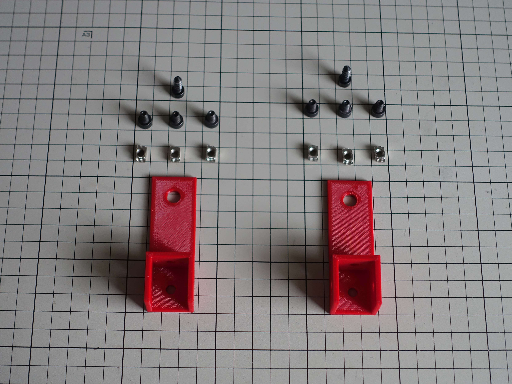
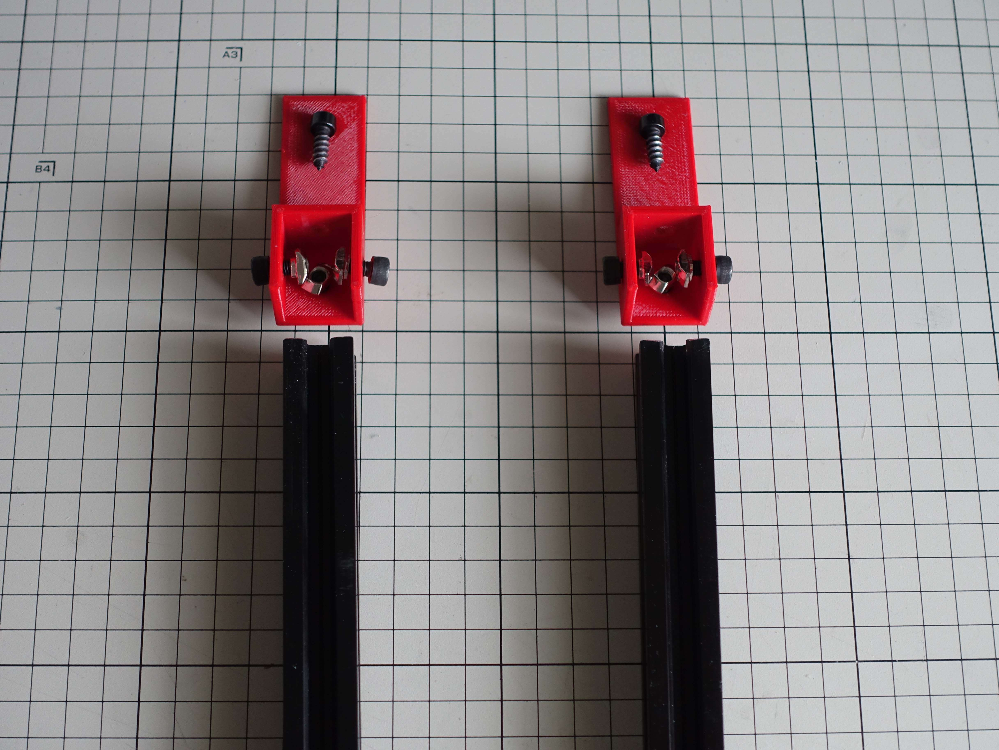
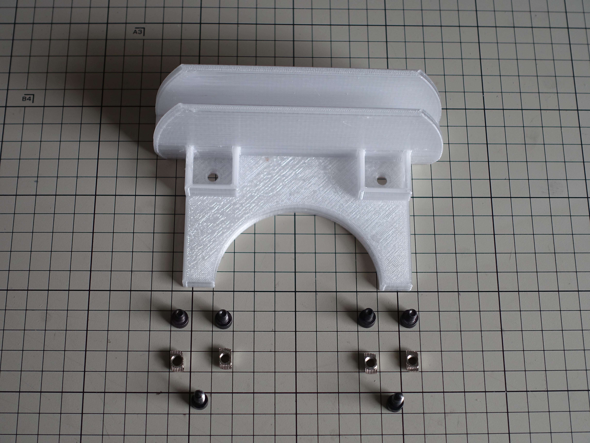
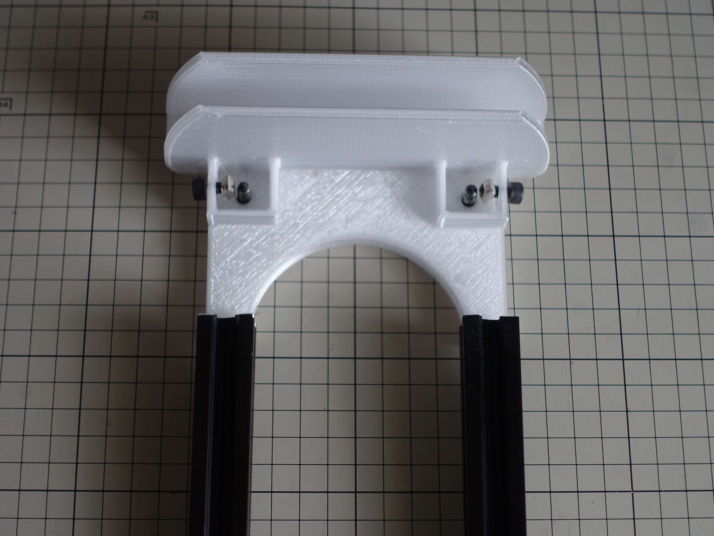

# Kown Storage
Kown Storage physically extends IKEA's "Bekant" ergonomic, adjustable height desks with various storage options. 

This release provides
- desk attachement
- single slot laptop holder
- dual slot laptop holder 

## Units
### Desk Attachement
Provided only as STL in this release

### Laptop Holder
The laptop holder allows to store one or two laptop on the side of the table. As it is attached to the top of the desk, the holder will move with the desk getting adjusted in height. All cables coming from the top of the desk like monitor connection and power supply can be a fixed length as laptops and desk move together.

The slots in the holder can be parametrized, respective fields are marked in the spreadsheets holding the data for the respective object in the FreeCAD source file.

### Cable Guards
```- to be designed -```

### Keyboard Holder
```- to be designed -```

## Printing Directions
The design assumes a 0.4 mm nozzle. 

Side walls are set to 2.8mm width, ie. 7x nozzle diameter. To avoid infill in the walls print with 3 perimeters as vertical shells. The sidewall thickness can be adjusted in the respective spreadsheet in the FreeCAD source file.

All parts have been printed with PETG at 0.25mm layer height.

## Assembly Instructions
<!-- 


 -->


## License 
All designs are licensed as CC BY-NC-SA
